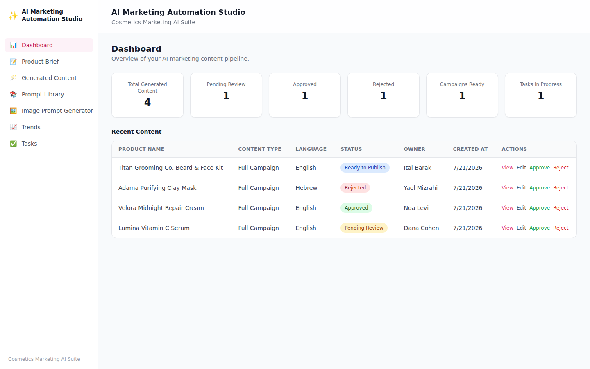
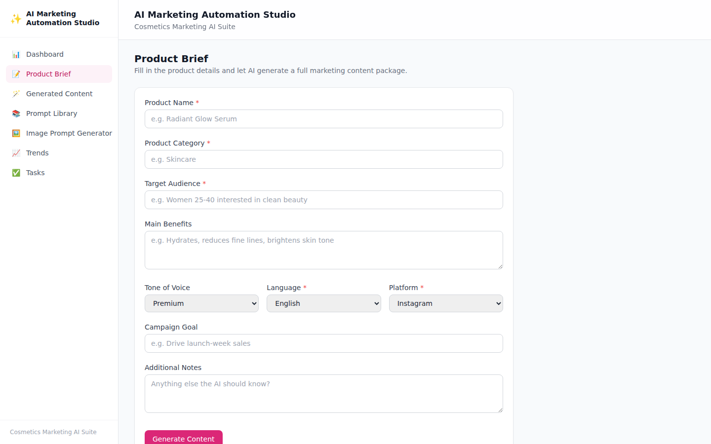
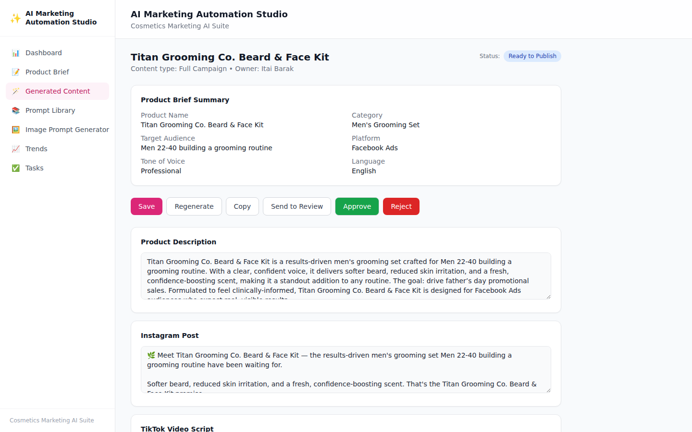
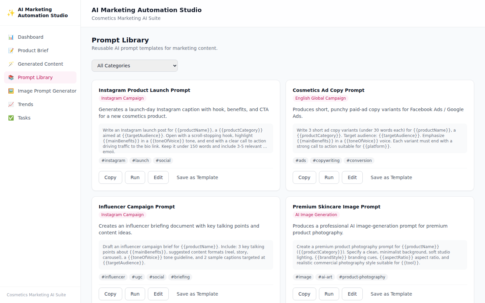
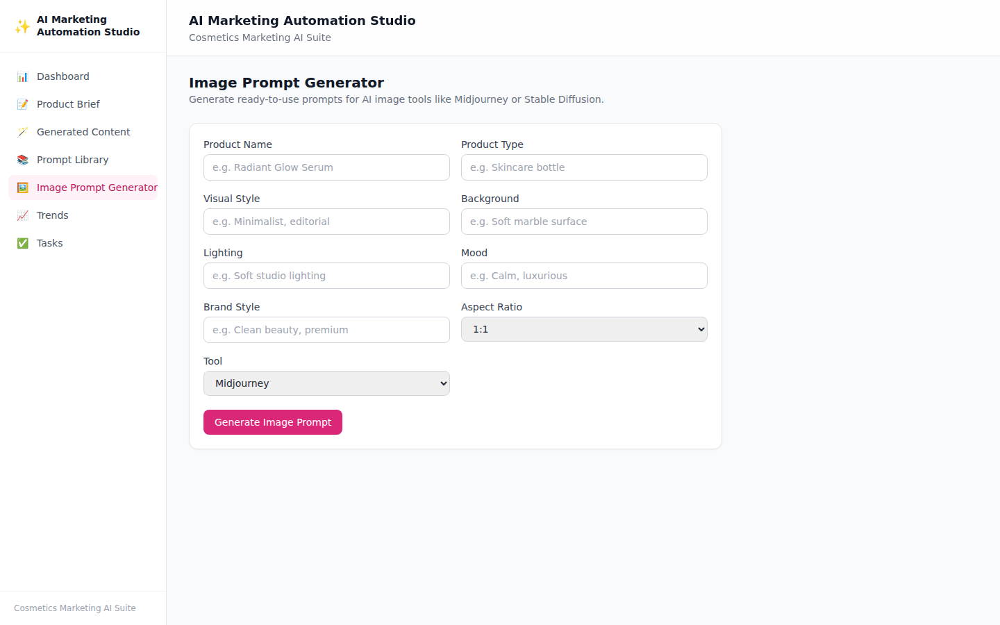
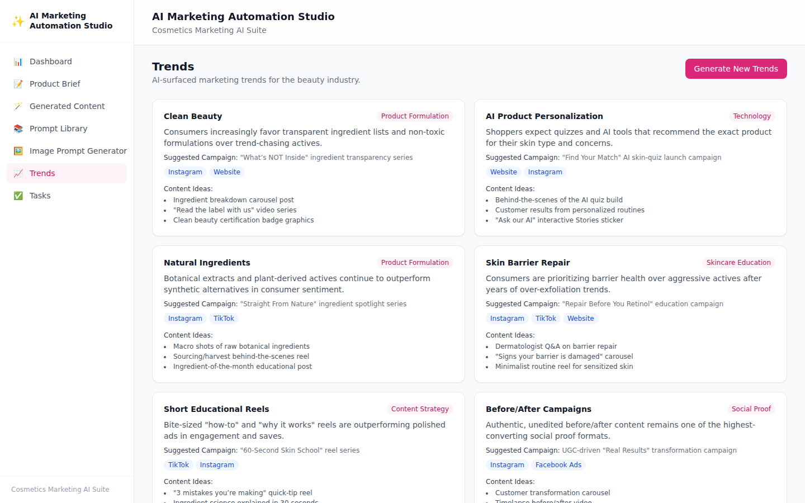
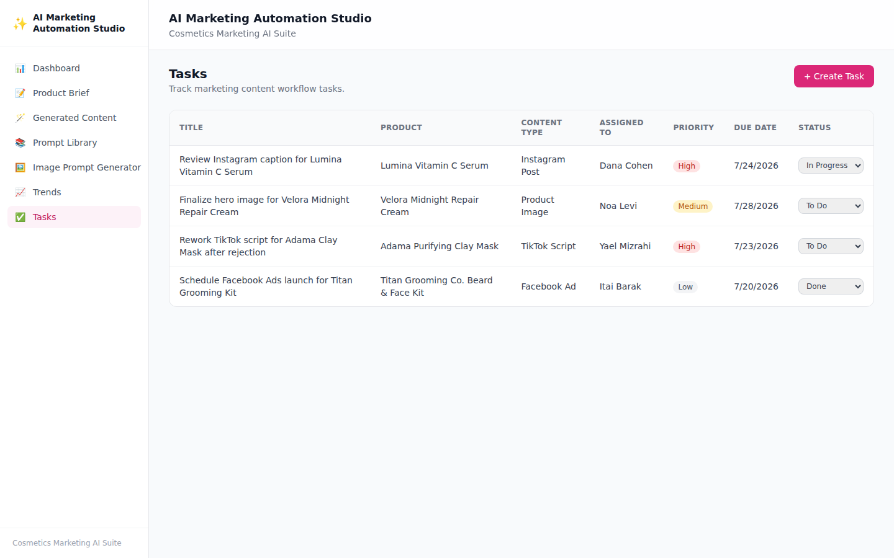

# AI Marketing Automation Studio

An AI-powered business automation platform for a cosmetics / e-commerce marketing team. Enter a product brief and the system generates a full content package — product description, Instagram post, TikTok script, email campaign, ad copy, SEO title, hashtags, and an image-generation prompt — then routes it through an approval and production workflow with a dashboard, a reusable prompt library, and a trend tracker.

## Why this project exists

This project is a portfolio piece built to demonstrate practical AI automation skills for roles that combine **AI content creation, prompt engineering, workflow automation, and full-stack product thinking**. Rather than a single AI text-generation demo, it models a realistic marketing team's daily workflow: brief → generate → review → approve → produce → publish, with a data model, REST API, dashboard, and automated test coverage behind it.

## Main Features

- **Product Brief → AI Content Generator** — enter a cosmetics product brief and generate a structured content package in one call (English or Hebrew).
- **AI Content Result / Content Details** — review, edit, regenerate, copy, and move content through Draft → Pending Review → Approved / Rejected → Ready to Publish.
- **Dashboard** — pipeline summary cards (total, pending, approved, rejected, campaigns ready, tasks in progress) and a content table with inline Approve/Reject actions.
- **Prompt Library** — reusable prompt templates by category (Instagram Campaign, TikTok Script, AI Image Generation, Hebrew Marketing Copy, etc.) with copy/run/edit/save-as-template actions.
- **AI Image Prompt Generator** — turns product/visual details into a ready-to-use prompt for Midjourney, Stable Diffusion, ChatGPT Image, Runway, or Pika.
- **Research & Trend Tracker** — AI-surfaced cosmetics/marketing trends with suggested campaigns, platforms, and content ideas.
- **Workflow Tasks** — track generated content as production tasks with owner, priority, due date, and status.
- **Pluggable AI layer** — real OpenAI integration when `OPENAI_API_KEY` is set, falling back to a realistic `MockAIService` (tone-aware, bilingual English/Hebrew copy) when it isn't — so the whole app runs and demos with zero API cost.
- **Playwright E2E coverage** across the core flows, wired into a GitHub Actions CI pipeline.

## Tech Stack

| Layer | Choice |
|---|---|
| Frontend | Next.js (App Router) + TypeScript, Tailwind CSS |
| Backend | NestJS (Node/TypeScript), REST API, Controller/Service layering |
| Database | PostgreSQL + Prisma ORM |
| AI Layer | OpenAI API (when configured) or a built-in `MockAIService`, behind a shared `AIService` interface |
| Testing | Playwright (E2E), Jest (backend unit tests) |
| CI/CD | GitHub Actions (lint, build, test, E2E, report artifact) |
| DevOps | Docker + docker-compose (frontend, backend, postgres) |

## Project Structure

```
backend/    NestJS API (Prisma schema, modules, AI service, seed data)
frontend/   Next.js dashboard UI
e2e/        Playwright E2E test suite
docs/       Screenshots
API_CONTRACT.md   Entity/endpoint contract shared by frontend and backend
```

## How to Run Locally

Requires Node.js 20+ and a PostgreSQL 16 instance.

```bash
# 1. Database
createdb ai_marketing_studio   # or use any Postgres instance

# 2. Backend
cd backend
cp .env.example .env           # set DATABASE_URL; leave OPENAI_API_KEY empty for MockAIService
npm install
npx prisma migrate deploy
npx prisma db seed
npm run start:dev              # http://localhost:4000/api

# 3. Frontend (in a second terminal)
cd frontend
cp .env.example .env
npm install
npm run dev                    # http://localhost:3000
```

Open `http://localhost:3000/dashboard` — you should see the seeded demo data (4 products, a mix of statuses, 4 tasks, 6 prompt templates, 6 trends).

## How to Run with Docker

```bash
cp .env.example .env   # optionally set OPENAI_API_KEY
docker compose up --build
```

This starts `postgres`, `backend` (runs `prisma migrate deploy` on boot, port 4000), and `frontend` (port 3000). Seed the database once the stack is up:

```bash
docker compose exec backend npx prisma db seed
```

Then visit `http://localhost:3000`.

## How to Run Playwright Tests

The E2E suite drives the real frontend + backend, so both must be running first (either via Docker or the local steps above).

```bash
cd e2e
npm install
npx playwright test          # headless run
npx playwright test --headed # watch it in a browser
npx playwright show-report   # view the HTML report
```

Set `E2E_BASE_URL` if the frontend isn't on the default `http://localhost:3000`.

**Coverage** (7 specs):
1. Product Brief Creation — fill the brief, generate content, land on the result page.
2. Generated Content Approval — generate content, approve it, verify status changes.
3. Prompt Library Copy — copy a prompt template, verify copy feedback.
4. Dashboard Summary — summary cards and content table render.
5. Task Workflow — create a task, update its status, verify the change.
6. Required Field Validation *(optional)* — empty submission shows inline errors.
7. Image Prompt Generation *(optional)* — generate and copy an image prompt.

## CI/CD

`.github/workflows/ci.yml` runs on every push/PR: backend lint/build/unit tests, frontend lint/build, then a full-stack job that migrates + seeds a real Postgres service container, boots both servers, runs the Playwright suite, and uploads the HTML report as a build artifact.

## Screenshots

| Dashboard | Product Brief |
|---|---|
|  |  |

| Generated Content | Prompt Library |
|---|---|
|  |  |

| Image Prompt Generator | Trends |
|---|---|
|  |  |

| Tasks |
|---|
|  |

## Demo Video

_Placeholder — record a 2-minute walkthrough following the Demo Script below and link it here._

## Demo Script (~2 minutes)

1. Open the Dashboard — show the pipeline summary and content table.
2. Create a product brief (Product Brief page) and generate AI content.
3. Review the generated Instagram post, email campaign, and image prompt.
4. Approve the content — watch its status update.
5. Open the Prompt Library and copy a template.
6. Generate an image prompt for a product photo.
7. Create a workflow task and move it to "In Progress".
8. Run the Playwright suite (`npx playwright test`).
9. Show the GitHub Actions pipeline passing (lint, build, test, E2E).

## Portfolio Card

**Project Title:** AI Marketing Automation Studio

**Short Description:** AI-powered automation platform for marketing teams. The system generates product content, image prompts, campaign ideas and workflow tasks for cosmetics/e-commerce products, including approval status, prompt templates and Playwright E2E coverage.

**Tech Stack:** Next.js, NestJS, PostgreSQL, OpenAI API, Playwright, GitHub Actions, Docker.

**Impact:**
- Automates repetitive marketing content creation
- Creates reusable AI prompt templates
- Supports multilingual (English/Hebrew) campaign generation
- Tracks production workflow status end-to-end
- Includes Playwright E2E test coverage
- Demonstrates AI-assisted business process automation

## Future Improvements

- Real authentication/roles (marketer, designer, approver) instead of a free-text "owner" field
- Status history / audit log persisted server-side instead of session-local review notes
- Real image generation (not just prompts) via an image model API
- Bulk actions on the dashboard table and generated-content list
- Pagination/infinite scroll for large content libraries
- Slack/email notifications on approval or task status changes
